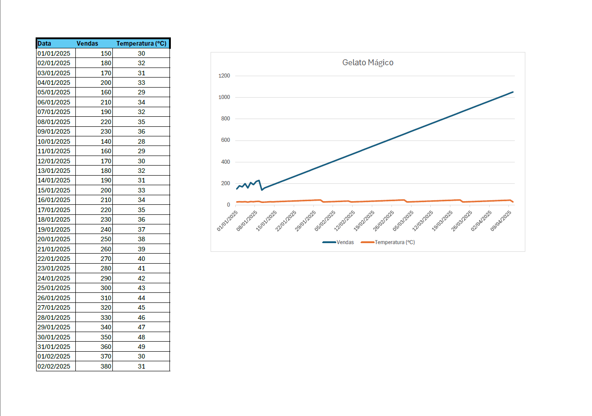

# Predicate Sales

This is a Machine Learning model of predictive regression. 
Trata-se de um modelo de Machine Learning de regressão preditiva. 
Se trata de un modelo de Machine Learning de regresión predictiva.

 

  

---

## 🗂️ Table of Contents | Índice | Indice

1. [About the Project | Sobre o Projeto | Sobre el Proyecto](#about-the-project--sobre-o-projeto--sobre-el-proyecto)
2. [Key Features | Caraterísticas Principais | Características Principales](#key-features--características-principais--características-principales)
3. [Technologies | Tecnologias | Tecnologías](#technologies--tecnologias--tecnologías)
4. [Authors and Acknowledgments | Autores e Agradecimentos | Autores y Agradecimientos](#authors-and-acknowledgments--autores-e-agradecimentos--autores-y-agradecimientos)

---

## 📃 About the Project | Sobre o Projeto | Sobre el Proyecto

\*Gelato Mágico** It's a project to create a Machine Learning model to predict future sales based on historical data   
\*Gelato Mágico** O projeto é um modelo de Machine Learning capaz de prever vendas futuras com base em dados históricos.   
\*Gelato Mágico\*\* Se trata de un proyecto para crear un modelo de Machine Learning que prediga las ventas futuras a partir de datos históricos.

### 📌 Why did we create Gelato Mágico? | Por que criamos o Gelato Mágico | ¿Por qué creamos el Gelato Mágico?

- É um projeto da DIO.  
  Um desafio de código.  

---

## 🚀 Key Features | Características Principais | Características principales

✅ Training a Machine Learning model to predict ice cream sales based on the day's temperature. 
Treinar um modelo de Machine Learning para prever as vendas de sorvete com base na temperatura do dia. 
Capacitar a un modelo de aprendizaje automático para predecir las ventas de helados en función de la temperatura del día.  
✅ Register and manage the model using MLflow. 
Registrar e gerenciar o modelo usando o MLflow. 
Registre y maneje el modelo utilizando MLflow.  
✅ Implement the model for real-time forecasts in a cloud computing environment. 
Implementar o modelo para previsões em tempo real em um ambiente de cloud computing. 
Implementar el modelo para previsiones en tiempo real en un entorno de computación en nube.  
✅ Create a structured pipeline to train and test the model, ensuring reproducibility. 
Criar um pipeline estruturado para treinar e testar o modelo, garantindo reprodutibilidade. 
Crear un procedimiento estructurado para entrenar y probar el modelo, garantizando su reproducibilidad.  

---

## 🚀 Technologies | Tecnologias | Tecnologías

This project (modelo preditivo) was developed using the following technologies:  
Este projeto (modelo preditivo) foi desenvolvido com as seguintes tecnologias:  
Este proyecto (modelo preditivo) se ha desarrollado utilizando las siguientes tecnologías:

> **Sobre o Modelo de Machine Learning**   > **Microsoft Azure**   > **MLflow**   > **Hiperparâmetros**   > **Pipeline**   > **Notebook Jupyter**   > **Python**  

---

## 💻 Authors and Acknowledgments | Autores e Agradecimentos | Autores y Agradecimientos

<h3 align="right">Um projeto do Bootcamp Microsoft Certification Challenge #3 DP-100 em parceria com a DIO</h3> 
<h4 align="right">Reproduzido com muito carinho por 🦅 Fernando</h4>
# dio  
# microsoft-certification-challenge-3-dp-100
